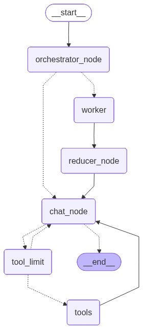
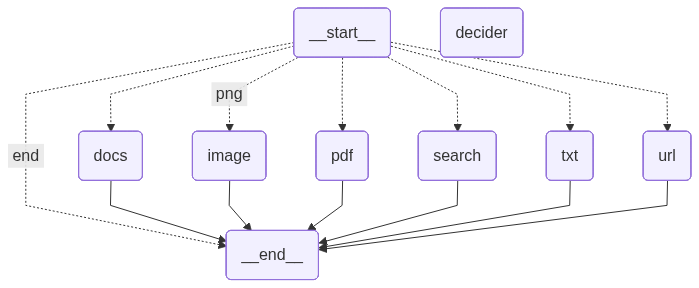

<div align="center">
  <h1>🚀 Multi-RAG AI Pipeline</h1>
  <p><strong>Advanced Multi-Agent RAG Orchestration powered by LangGraph, AWS Bedrock, and FAISS</strong></p>

  [](https://www.python.org/)
  [](https://github.com/langchain-ai/langgraph)
  [](https://fastapi.tiangolo.com/)
  [](https://github.com/facebookresearch/faiss)
</div>

---

## 📖 Overview

**Multi-RAG AI** is a state-of-the-art, multi-agent RAG (Retrieval-Augmented Generation) pipeline designed for high-performance document intelligence. It leverages **LangGraph** for sophisticated orchestration, allowing an autonomous "Orchestrator" agent to decide which specialized workers (PDF, DOCX, TXT, Images, Web Search) are needed to answer complex user queries.

### Why Multi-RAG?
- **Intelligent Fan-out**: The orchestrator can trigger multiple workers in parallel to gather information from different sources.
- **Dynamic Routing**: Automatically detects file types and routes tasks to specialized loaders.
- **OCR Integration**: Built-in support for image processing and optical character recognition.
- **Web Search Fallback**: If local documents are insufficient, the agents can autonomously search the live web.

---

## 🏗️ Architecture

The system is built as a nested graph structure, providing a clean separation between high-level orchestration and low-level specialized tasks.

### 1. Main Orchestration Graph
The main graph handles the interaction between the user, the orchestrator, and the final chat response.



### 2. Worker Sub-Graph
The worker sub-graph is responsible for specialized information retrieval from various file formats.



---

## ✨ Key Features

- **📂 Multi-Format Support**:
  - **PDF**: Deep document parsing.
  - **DOCX**: Microsoft Word document integration.
  - **TXT**: Plain text analysis.
  - **Images (OCR)**: Extraction of text from PNG/JPG using specialized loaders.
- **🤖 Autonomous Orchestration**: Uses a Llama-3.3-70B model on **AWS Bedrock** with a manual JSON fallback mechanism for 100% reliable structured output.
- **🔍 Advanced Retrieval Pipeline**:
  - **Hybrid Search**: Combines semantic vector search with keyword-based BM25 for maximum precision.
  - **RRF (Reciprocal Rank Fusion)**: Merges multiple retrieval streams with mathematical rigor.
  - **Reranking**: Uses `Flashrank` to re-score and filter the most relevant context before generation.
  - **Multi-Query Expansion**: Generates multiple perspectives of a user query to capture hidden context.
- **🧠 Persistence & Memory**: Full multi-turn conversation support with LangGraph checkpointers.
- **⚡ Modern Tech Stack**: Built with `uv` for lightning-fast dependency management and `FastAPI` for a high-performance backend.

---

## 🔍 Advanced Retrieval Pipeline

Multi-RAG doesn't just "search" — it employs a sophisticated multi-stage retrieval architecture to ensure the LLM receives the most accurate and relevant context possible.

| Technique | Description | Benefit |
| :--- | :--- | :--- |
| **Hybrid Search** | Dual-path retrieval using **FAISS (Dense)** and **BM25 (Sparse)**. | Captures both deep semantic meaning and exact keyword matches. |
| **Multi-Query** | The Orchestrator decomposes complex queries into multiple specialized sub-tasks. | Ensures no part of a complex request is overlooked. |
| **RRF** | **Reciprocal Rank Fusion** algorithm to merge results from different retrievers. | Provides a unified, unbiased ranking of candidates. |
| **Reranker** | **Flashrank-based cross-encoding** to re-evaluate the top-K results. | Drastically reduces "hallucinations" by filtering out low-relevance noise. |

---

---

## 🛠️ Tech Stack

- **Core**: [Python 3.12](https://www.python.org/)
- **Orchestration**: [LangGraph](https://github.com/langchain-ai/langgraph) & [LangChain](https://github.com/langchain-ai/langchain)
- **Large Language Models**: [AWS Bedrock](https://aws.amazon.com/bedrock/) (Llama 3.3 70B)
- **Vector Storage**: [FAISS](https://github.com/facebookresearch/faiss)
- **Embeddings**: [HuggingFace](https://huggingface.co/) (all-MiniLM-L6-v2)
- **Backend API**: [FastAPI](https://fastapi.tiangolo.com/)
- **Package Management**: [uv](https://github.com/astral-sh/uv)

---

## 🚀 Getting Started

### Prerequisites
- Python 3.12+
- `uv` installed (`pip install uv`)
- AWS Credentials (for Bedrock access)

### 1. Installation
```bash
# Clone the repository
git clone https://github.com/VashuTheGreat/Multi-Rag.git
cd Multi-Rag

# Install dependencies
uv sync
```

### 2. Environment Setup
Create a `.env` file in the root directory:
```env
# AWS Bedrock Config
AWS_ACCESS_KEY_ID=your_access_key
AWS_SECRET_ACCESS_KEY=your_secret_key
AWS_REGION_NAME=us-east-1

# Tooling (e.g., Search API keys if applicable)
# ...
```

### 3. Run the Application
```bash
# Start the FastAPI server
uv run main.py
```
Navigate to `http://127.0.0.1:8000` to start chatting with your documents!

---

## 📂 Project Structure

```bash
Multi-Rag/
├── api/                # FastAPI Endpoints & Controllers
├── src/
│   └── MultiRag/
│       ├── components/ # Core graph runners & embedders
│       ├── graph/      # LangGraph definitions (Main & Worker)
│       ├── models/     # Pydantic state & output schemas
│       ├── nodes/      # Individual graph node implementations
│       ├── prompts/    # LLM system prompts
│       └── utils/      # Ingestion & document processing utilities
├── static/             # Frontend assets (CSS, JS)
├── templates/          # Jinja2 HTML templates
└── db/                 # Local FAISS index persistence
```

---

<div align="center">
  <p>Built with 💖 for the future of Agentic RAG.</p>
</div>
