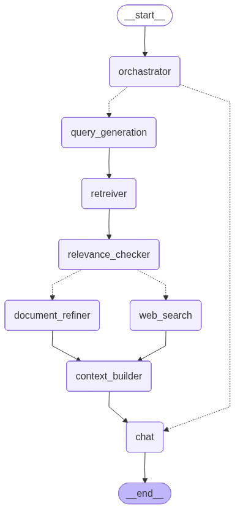

# 🧠 Multi-RAG — Advanced Multi-Modal Retrieval Augmented Generation

<p align="center">
  
  
  
  
  
  
  
</p>

A production-grade, **session-aware multi-modal RAG system** built with LangGraph, FastAPI, and a hybrid retrieval pipeline. Upload PDFs, DOCX, TXT, or images — get intelligent, context-grounded answers powered by an adaptive agentic graph that decides when to search your documents, when to fall back to the web, and when to just chat.

---

## 📸 Agent Graph

The LangGraph pipeline is fully visualized below — each node represents a stage in the decision-making workflow:



| Node | Role |
|---|---|
| `orchastrator` | Routes query: DB search needed or direct chat? |
| `query_generation` | Generates semantically rich retrieval queries |
| `retreiver` | Hybrid FAISS + BM25 + FlashRank reranking |
| `relevance_checker` | Evaluates if retrieved docs are CORRECT / AMBIGUOUS / INCORRECT |
| `document_refiner` | Passes verified docs to context builder |
| `web_search` | Tavily-powered fallback when docs are insufficient |
| `context_builder` | Assembles multimodal context (text + tables + images) |
| `chat` | Generates final Markdown response |

---

## ✨ Features

- 🗂 **Multi-Format Ingestion** — PDF, DOCX, TXT, PNG/JPG/HEIF; all converted to a unified PDF pipeline
- 🔍 **Hybrid Retrieval** — FAISS (dense) + BM25 (sparse) via `EnsembleRetriever`, re-ranked with FlashRank
- 🧩 **Multimodal Chunks** — Extracts text, tables (HTML), and base64-encoded images from documents
- 🤖 **Agentic LangGraph Workflow** — Adaptive routing with conditional edges; not just a static RAG chain
- 🌐 **Web Search Fallback** — Tavily search kicks in when retrieved docs are insufficient
- 💾 **Session Persistence** — Per-user thread IDs with `InMemorySaver` checkpointing; conversation history preserved
- 🔐 **Auth Middleware** — Lightweight session-based authentication on every request
- 🖥 **Full Web UI** — Jinja2-rendered frontend with upload flow, chat interface, and document explorer
- 🐳 **Docker Ready** — Single `Dockerfile` for deployment; also supports Jenkins CI
- 📝 **Rotating Logs** — Timestamped rotating log files under `logs/`

---

## 🏗 Architecture

```
Multi-Rag/
├── main.py                          # Entrypoint — loads .env, starts FastAPI
├── api/
│   ├── main.py                      # FastAPI app, middleware, router registration
│   ├── routes/
│   │   ├── upload_router.py         # File upload handling
│   │   ├── ingest_docs_router.py    # Triggers vectorization pipeline
│   │   ├── chat_router.py           # Chat endpoint → LangGraph invocation
│   │   ├── user_router.py           # Session/thread management
│   │   ├── load_conversation_router.py  # Restore chat history
│   │   └── frontend_router.py       # Serves HTML pages
│   ├── middlewares/
│   │   └── Authenticate_middleware.py
│   ├── templates/                   # Jinja2 HTML templates
│   └── static/                      # CSS / JS assets
│
├── src/
│   ├── graphs/
│   │   └── builder.py               # LangGraph StateGraph definition
│   ├── nodes/
│   │   └── main_nodes.py            # All 8 node implementations
│   ├── states/
│   │   └── Main_State.py            # LangGraph State + Pydantic output schemas
│   ├── pipeline/
│   │   ├── Vectiorizer_pipeline.py  # Ingestion + Transformation orchestration
│   │   └── GraphRunner_pipeline.py  # Graph execution wrapper
│   ├── components/
│   │   ├── data_ingestion.py        # File-to-PDF conversion dispatch
│   │   ├── data_transformation.py   # PDF → chunks → FAISS vector store
│   │   └── run_graph.py             # graph.ainvoke() wrapper
│   ├── retrievers/
│   │   └── create_retreivers.py     # Hybrid retriever + FlashRank compression
│   ├── prompts/
│   │   └── prompt_templates.py      # All LLM prompt templates
│   ├── entity/
│   │   ├── config_entity.py         # Dataclass configs
│   │   └── artifact_entity.py       # Dataclass artifacts
│   ├── llm/
│   │   └── llm_loader.py            # Groq ChatGroq instantiation
│   ├── memory/
│   │   └── __init__.py              # InMemorySaver checkpointer
│   ├── tools/
│   │   └── __init__.py              # Tavily web search StructuredTool
│   ├── constants/
│   │   └── __init__.py              # Global constants
│   └── utils/
│       ├── ingestion_utils.py       # image_to_pdf, text_to_pdf, docs_to_pdf
│       └── asyncHandler.py          # Async decorator for uniform error handling
│
├── exception/
│   └── __init__.py                  # MyException with structured logging
├── logger/
│   └── __init__.py                  # RotatingFileHandler setup
├── Dockerfile
├── jenkins
└── pyproject.toml
```

---

## 🔄 RAG Pipeline Flow

```
User Uploads Files
       │
       ▼
┌─────────────────────────────────────────────────┐
│              Vectorization Pipeline              │
│                                                  │
│  File → docs_to_pdf → partition_pdf (hi_res)    │
│       → chunk_by_title → FAISS + Embeddings     │
│       → saved per thread_id                     │
└─────────────────────────────────────────────────┘
       │
       ▼
User Sends Chat Message
       │
       ▼
┌─────────────────────────────────────────────────┐
│                LangGraph Agent                   │
│                                                  │
│  Orchestrator ──→ Query Generation               │
│                       │                          │
│                   Retriever (Hybrid)              │
│                       │                          │
│               Relevance Checker                  │
│              ┌─────────┴────────┐                │
│         CORRECT/           INCORRECT             │
│         AMBIGUOUS                │               │
│              │             Web Search            │
│         Document                │                │
│         Refiner                 │                │
│              └────────┬─────────┘               │
│                  Context Builder                  │
│                       │                          │
│                     Chat                         │
└─────────────────────────────────────────────────┘
```

---

## ⚙️ Tech Stack

| Layer | Technology |
|---|---|
| **LLM** | Groq (`llama-3.x` / configurable) |
| **Embeddings** | `sentence-transformers/all-MiniLM-L6-v2` via HuggingFace |
| **Vector Store** | FAISS (CPU) |
| **Sparse Retrieval** | BM25 (`rank-bm25`) |
| **Reranking** | FlashRank |
| **Web Search** | Tavily (`langchain-tavily`) |
| **Agent Framework** | LangGraph 1.x (`StateGraph`) |
| **Orchestration** | LangChain 1.x |
| **Document Parsing** | `unstructured[all-docs]` + `pdfminer-six` + `pdf2image` |
| **OCR** | EasyOCR + Tesseract |
| **API** | FastAPI + Uvicorn |
| **Frontend** | Jinja2 + Vanilla JS |
| **Memory** | LangGraph `InMemorySaver` |
| **Packaging** | `uv` + `pyproject.toml` |

---

## 🚀 Getting Started

### Prerequisites

```bash
# System dependencies (Ubuntu/Debian)
sudo apt-get install -y \
  tesseract-ocr \
  libtesseract-dev \
  poppler-utils \
  libmagic-dev
```

### Installation

```bash
# Clone the repo
git clone https://github.com/VashuTheGreat/Multi-Rag.git
cd Multi-Rag

# Create virtual environment with uv
pip install uv
uv venv
source .venv/bin/activate

# Install all dependencies
uv sync
```

### Environment Variables

Copy `.env.example` to `.env` and fill in your keys:

```bash
cp .env.example .env
```

```env
GROQ_API_KEY=your_groq_api_key
TAVILY_API_KEY=your_tavily_api_key
```

### Run

```bash
uvicorn main:app --host 0.0.0.0 --port 8000 --reload
```

Navigate to `http://localhost:8000`

---

## 🐳 Docker

```bash
docker build -t multi-rag .
docker run -p 7860:7860 --env-file .env multi-rag
```

---

## 📁 Supported File Types

| Format | Conversion Path |
|---|---|
| `.pdf` | Used directly by `unstructured` |
| `.docx` | `python-docx` → `fpdf2` → PDF |
| `.txt` | `fpdf2` → PDF |
| `.png / .jpg / .heif` | `Pillow` → PDF |

---

## 🧩 Key Design Decisions

- **Adaptive Routing** — The orchestrator decides per-query whether vector search is needed, avoiding unnecessary DB calls for greetings/small talk.
- **Hybrid Retrieval** — FAISS (70%) + BM25 (30%) ensemble captures both semantic and keyword relevance; FlashRank re-ranks the top results.
- **Relevance Gating** — A dedicated LLM call classifies retrieved docs as `CORRECT`, `AMBIGUOUS`, or `INCORRECT` before deciding whether to use them or fall back to web search.
- **Per-Thread Isolation** — Each user session gets its own `thread_id`; vector stores and artifacts are namespaced by thread to prevent cross-user data leakage.
- **Multimodal Context** — The `context_builder` node assembles text, HTML tables, and base64 images extracted from document chunks into a rich multimodal prompt.

---

## 📜 License

[MIT](LICENSE)

---

## 👤 Author

**VashuTheGreat (Vansh Sharma)**

> Built with ☕ and an unhealthy obsession with RAG pipelines.
